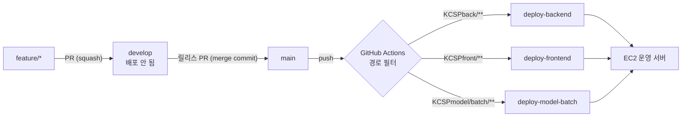

# 작업 · 배포 가이드

이 레포는 **`main` 에 들어간 코드가 곧 운영 서버에 배포**된다. 그래서 작업은 `develop` 에 모으고,
배포할 때만 `develop → main` 으로 올린다. 아래 순서만 지키면 배포 사고 없이 같이 작업할 수 있다.

## 1. 브랜치

| 브랜치 | 용도 | 어디서 따나 | 어디로 머지하나 |
|---|---|---|---|
| `main` | 운영(배포) | — | — |
| `develop` | 개발 통합 | — | `main` (릴리스 PR) |
| `feature/*` | 기능·수정·데이터 작업 | `develop` | `develop` |
| `hotfix/*` | 운영 긴급 수정 | `main` | `main` → 끝나면 `develop` 에도 반영 |

```bash
git fetch origin
git checkout -b feature/redpepper-pipeline origin/develop
```

- 브랜치 이름은 영어 소문자·하이픈 (`feature/onion-weather`, `hotfix/nongnet-timeout`)
- **`main` 에 직접 push 하지 않는다.** 경로만 맞으면 그대로 배포된다(3절)

## 2. 커밋 메시지

```
<type>: <무엇을 했는지, 명사형으로 끝냄>

<필요하면 본문: 왜 바꿨는지, 무엇을 확인했는지>
```

| type | 쓰는 곳 | 예시 (이 레포 이력) |
|---|---|---|
| `feat` | 기능 추가 | `feat: 양파 순별 가격 예측 파이프라인 추가` |
| `fix` | 버그 수정 | `fix: 예측 파이프라인이 KST 기준 날짜로 순을 판정하도록 수정` |
| `data` | 학습용 CSV 등 데이터 추가·갱신 | `data: 홍고추 순별 출하지역 추가` |
| `ops` | 서버·타이머·배포 설정 | `ops: DB 일일 백업 추가 (mysqldump + systemd 타이머)` |
| `docs` | 문서 | `docs: 작업·배포 가이드 추가` |
| `chore` | 그 밖의 정리 | `chore: 프로덕션 JPA SQL 로그 비활성화` |
| `refactor` | 동작 변화 없는 구조 변경 | |

- 제목은 **명사형으로 끝낸다** — `~추가`, `~수정`, `~정리`, `~통일`. `~한다` 평서문은 쓰지 않는다
- 스코프는 붙이지 않는다 (`feat(model): …` ✗ → `feat: …` ✓)
- 한 커밋에 한 가지. 데이터(`data`)와 코드(`feat`)는 가능하면 나눈다

## 3. 배포는 어떻게 연결되나



`develop` 에 머지해도 **아무것도 배포되지 않는다.** `main` 에 push 되는 순간, 바뀐 경로에 해당하는 워크플로만 돈다.
경로에 안 걸리는 변경(루트 문서, `ops/` 등)은 `main` 에 들어가도 배포되지 않는다.

| 워크플로 | 트리거 경로 | 하는 일 | 실패 판정 |
|---|---|---|---|
| `deploy-backend.yml` | `KCSPback/**` | Gradle 빌드 → jar 업로드 → `releases/backend-<sha>.jar` 로 교체 → `agriforecast` 서비스 재시작 | 90초 안에 `/api/price/items` 가 응답하지 않으면 **이전 jar 로 자동 롤백** 후 실패 |
| `deploy-frontend.yml` | `KCSPfront/**` | `npm ci && npm run build` → `dist/` 업로드 → nginx 정적 경로에 rsync → `nginx -t` 후 reload | 빌드 실패 또는 `nginx -t` 실패 |
| `deploy-model-batch.yml` | `KCSPmodel/batch/**` | 파이프라인·`hist_*.csv`·systemd 유닛 복사 → 타이머 등록 → **품목별 파이프라인을 실제로 1회 실행** | 한 품목이라도 실행 결과가 `success` 가 아니면 실패 |

- 세 워크플로 모두 Actions 탭에서 **수동 실행(`workflow_dispatch`)** 도 된다. 코드 변경 없이 다시 배포할 때 쓴다
- 서버 접속 정보는 레포 Secrets(`EC2_HOST`, `EC2_USER`, `EC2_SSH_KEY`)에만 있다. 문서·코드에 적지 않는다

### 배포 뒤 서버에서 자동으로 도는 것

| 작업 | 시각 (KST) | 정의 위치 |
|---|---|---|
| DB 백업 | 매일 03:00 | `ops/backup/` (**자동 배포 안 됨**, 서버에 수동 설치) |
| 배추 예측 | 매일 05:30 | `KCSPmodel/batch/agriforecast-predict.timer` |
| 양파 예측 | 매일 05:50 | `KCSPmodel/batch/agriforecast-predict-onion.timer` |
| 가격·반입량·검색량 등 수집 | 백엔드 스케줄러 | `KCSPback` 의 `@Scheduled` |

타이머 파일의 `OnCalendar` 는 **UTC** 로 적혀 있다(서버 TZ 가 UTC). KST 로 착각하지 말 것.

## 4. PR

- **base 는 `develop`** (`gh pr create --base develop`). 레포 기본 브랜치가 `main` 이라 그냥 만들면 `main` 으로 잡힌다 — 꼭 확인
- 제목은 커밋과 같은 형식 (`feat: …`)
- 작업 중이면 **Draft PR** 로 먼저 열고 같은 브랜치에 이어 올린다
- 머지 방식
  - `feature/*` → `develop`: **Squash and merge**
  - `develop` → `main`, `hotfix/*` → `main`, `main` → `develop`: **Create a merge commit** (두 브랜치의 조상 관계를 유지해야 다음 릴리스 PR 에 충돌이 안 난다)

본문에는 최소한 아래를 적는다.

```markdown
## 목적
무엇을 왜 바꾸는지

## 변경
- 

## 확인
어떻게 확인했는지 (로컬 실행, 테스트, 홀드아웃 지표 등)

## 배포 영향
어느 워크플로가 도는지 / 서버에서 따로 할 일이 있는지
```

## 5. 릴리스 (배포하기)

1. `develop` 에서 `main` 으로 PR 을 연다. 제목 예: `release: 홍고추 예측 추가`
2. 본문에 이번에 나가는 PR 목록과 **돌게 될 워크플로**를 적는다
3. Merge commit 으로 머지 → Actions 탭에서 워크플로가 초록불인지 확인
4. 확인할 곳
   - 백엔드: 화면이 뜨는지, `journalctl -u agriforecast -n 100`
   - 프론트: 강력 새로고침 후 화면 확인
   - 모델: 워크플로 로그의 파이프라인 출력, 다음 날 아침 타이머 실행 결과 `journalctl -u agriforecast-predict`

### 되돌리기

- **백엔드 헬스체크 실패는 워크플로가 자동으로 이전 jar 로 되돌린다.** 워크플로는 실패로 끝난다
- 그 밖에 배포 후에 문제를 발견하면 `main` 에서 해당 머지를 `git revert -m 1 <머지 커밋>` 하는 `hotfix/*` PR 을 올린다. revert 가 `main` 에 들어가면 같은 워크플로가 다시 돌아 이전 상태로 배포된다
- 같은 커밋을 다시 배포하면 백엔드 롤백 대상이 없다(이전 = 새 jar). 롤백이 필요하면 revert 로 새 커밋을 만든다

## 6. 배포할 때 주의할 점

**레포에 없는 서버 전용 상태** — 워크플로가 건드리지 않는다. 바꿔야 하면 서버에서 직접 하고 PR 본문에 남긴다.

- `/opt/agri-forecast/application-secret.properties` — API 키·DB 계정. **절대 커밋하지 않는다**
- `/etc/systemd/system/agriforecast.service` — 백엔드 서비스 유닛(JVM 옵션 `-Duser.timezone=Asia/Seoul` 포함)
- nginx 설정, `ops/backup` 타이머

**모델 배치**

- 새 품목 파이프라인을 추가하면 `deploy-model-batch.yml` 의 **복사 목록·타이머 등록·검증 루프에 직접 추가**해야 한다. 파일만 넣으면 서버에 안 올라간다
- `data/hist_*.csv` 는 배포 때마다 덮어쓴다. `weather_*.csv` 는 서버가 매일 갱신하므로 **없을 때만** 복사한다
- `KCSPmodel/batch/requirements.txt` 버전 고정을 풀지 않는다 — pandas 2.2.3(3.x 는 실행 불가), xgboost 3.2.0(버전이 오르면 성능이 떨어진다). 워크플로는 패키지를 설치하지 않으므로, 바꾸면 서버 venv 에 직접 반영해야 한다
- 날짜·순 판정은 반드시 KST 기준(`kst_today()`). 서버 시계는 UTC 다

**외부 수집원(농넷 등)**

- 테스트한다고 짧은 시간에 요청을 많이 보내지 않는다. 과거에 과다 요청으로 차단된 적이 있다
- 확인은 1회 요청으로, 대량 수집은 1초 이상 간격을 두고 한다
